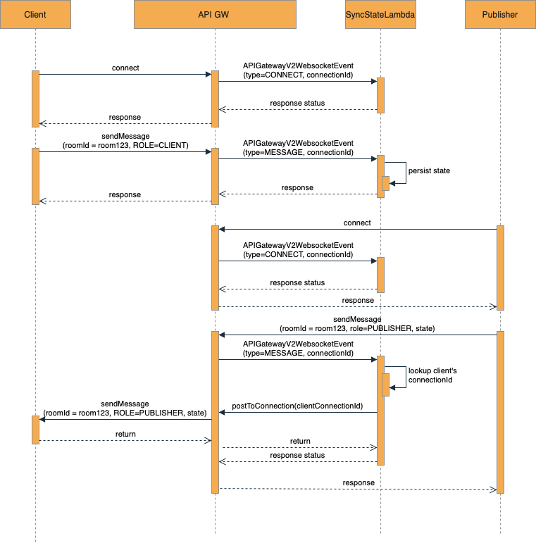
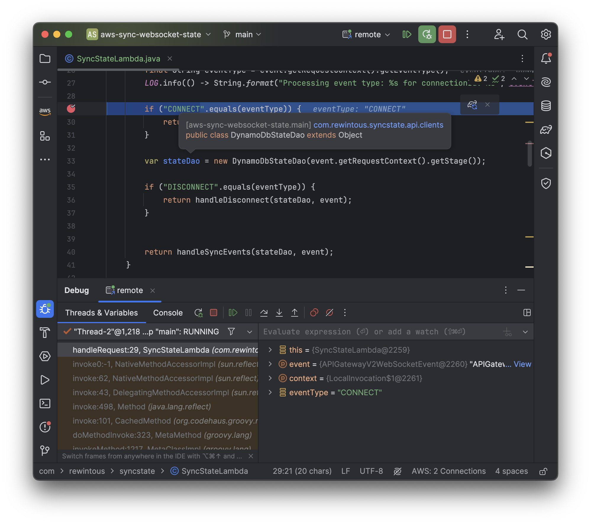
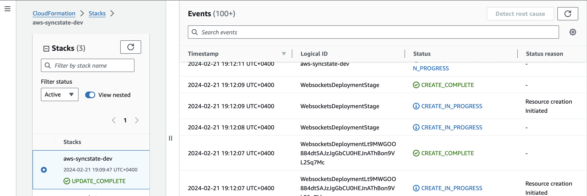
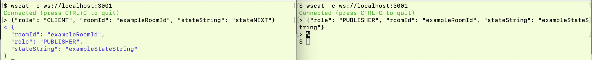

# Serverless Framework & AWS: Seamless API Gateway & WebSocket Integration, Online & Offline

## Overview

### Motivation for the demo
Debugging Lambda functions step-by-step that serve as `AWS_PROXY` integration endpoints is hard.
This is primarily due to the poor quality of open-source tooling available as of February 2024.

For four years, the SAM framework provided by AWS has not supported the sam local start-api command for WebSocket events 
and integration, which limits the capabilities for step-by-step debugging in an IDE. The corresponding ticket was filed
a while ago: https://github.com/aws/aws-sam-cli/issues/896

I can probably advocate using https://www.localstack.cloud/pricing but this example is all about freeware software.

For this demo, I've made it possible to run everything with local step-by-step debugging and seamless deployment to AWS 
via CloudFormation templates using the Serverless framework, along with Serverless Offline and dynamodb-local plugins

### Interaction between components

TL;DR we have an API Gateway instance serving websocket. The websocket is used as a transport to connect 2 users 
(CLIENT and PUBLISHER) to a single room. As soon as user is connected and sends an update for the room with id=`roomId`, 
a mapping between roomId and connectionId is persisted to the DynamoDB table. 
Only updates from PUBLISHER are forwarded to the CLIENT if they are connected to the same room.

Here comes an activity diagram.

### Known limitations of Serverless Framework

* Without custom image for runtime it was not possible to run java runtime with JDK version greater than 8(!). 
The reason is described here: https://github.com/dherault/serverless-offline/issues/1710 TL;DR:
https://github.com/bytekast/serverless-toolkit is poorly maintained and was not upgraded for a while. 
A workaround is to use custom image which I didn't bother about in this demo.
* Java step by step debug is performed via running `java-invoke-local-all.jar` with debug server parameters, e.g. 
`/usr/bin/java -agentlib:jdwp=transport=dt_socket,server=y,suspend=n,address=5005` and connecting to the process remotely

* Setting up multiple API GW in a single serverless yml template is a bit cumbersome (and probably not even required)

## Setup tools for the demo

1. Install serverless framework globally with: `npm install -g serverless`
2. Install serverless offline plugin: `npm install -g serverless-offline`
3. Install (better maintained) dynamodb-local plugin: `npm install -g serverless-dynamodb`
4. Install java-invoke-local plugin: `npm install -g java-invoke-local`
   Docker is required: i.e. [https://docs.docker.com/engine/install/](https://docs.docker.com/engine/install/)
5. Install WebSocket client, i.e. `wscat` to run everything from the command line.

## Preparations for Local (offline) setup

### Spin up java code in debug mode
1. Locate `java-invoke-local-all.jar` and `export PATH_TO_JAVA_INVOKE_JAR={prefix}/lib/node_modules/java-invoke-local/build/libs/java-invoke-local-all.jar`
2. Export `JDK_8_HOME` variable pointing to JDK 8 Home
3. Build the project with Gradle: `gradle build`
4. export JAVA_HOME=$PATH_TO_JDK8` to allow java-invoke-local to run
5. Setup remote debug: `JAVA_TOOL_OPTIONS=-agentlib:jdwp=transport=dt_socket,server=y,suspend=n,address=5005`
6. Then run ` $JAVA_HOME/bin/java -jar $PATH_TO_JAR --server`

OR

For your convenience a build and run script for steps is created, export JDK_8_HOME and PATH_TO_JAVA_INVOKE_JAR 
 and run `./build_run_java_debug.sh`

if everything is fine, the following output should be:

    $ ./build_run_java_debug.sh
    
    BUILD SUCCESSFUL in 1s
    5 actionable tasks: 2 executed, 3 up-to-date
    Picked up JAVA_TOOL_OPTIONS: -agentlib:jdwp=transport=dt_socket,server=y,suspend=n,address=5005
    Listening for transport dt_socket at address: 5005

### Spin local DynamoDB database

1. Make sure docker is running
2. Run `sls dynamodb start -s local` for a local stage - this will start DynamoDB on port 8000

Following output is expected:

     $ sls dynamodb start -s local
     Running "serverless" from node_modules
     (node:20377) [DEP0040] DeprecationWarning: The `punycode` module is deprecated. Please use a userland alternative instead.
     (Use `node --trace-deprecation ...` to show where the warning was created)
     Initializing DynamoDB Local with the following configuration:
     Port:   8000
     InMemory:       true
     Version:        2.2.1
     DbPath: null
     SharedDb:       true
     shouldDelayTransientStatuses:   true
     CorsParams:     *

### Start API Gateway WebSocket proxy with local serverless stack

`sls offline`

This will create a local emulation of API GW endpoints, as well as http invocations of corresponding lambda functions 
(if any).

You should see somtehing like:

    % sls offline
    Running "serverless" from node_modules
    (node:18626) [DEP0040] DeprecationWarning: The `punycode` module is deprecated. Please use a userland alternative instead.
    (Use `node --trace-deprecation ...` to show where the warning was created)
    
    Starting Offline at stage local (us-east-1)
    
    Offline [http for lambda] listening on http://localhost:3002
    Function names exposed for local invocation by aws-sdk:
    * syncstate: aws-syncstate-dev-syncstate
    route '$connect (λ: syncstate)'
    route '$disconnect (λ: syncstate)'
    route '$default (λ: syncstate)'
    Offline [websocket] listening on ws://localhost:3001
    Offline [http for websocket] listening on http://localhost:3001

### Enable DEBUG and breakpoints in IDE

Now you can connect to the remote java process for step-by-step debug:

## Deploying to AWS

All resources, configuration, roles, lambda functions can be deployed to required stage with just 2 operations:
Local

1. build code with `gradle build`
2. make sure local aws profile should be configured.
3. run `sls` and follow the deployment instructions:

    $ sls
    Running "serverless" from node_modules
    (node:20621) [DEP0040] DeprecationWarning: The `punycode` module is deprecated. Please use a userland alternative instead.
    (Use `node --trace-deprecation ...` to show where the warning was created)
    
    ? Do you want to deploy now? (Y/n) 

If everything is OK, the CloudFormation stack will be created and applied to your AWS account.

## Finally, DEMO

1. Check the output from either `sls` or `sls offline`, copy websocket address (local or API GW)
2. Bring up 2 terminals and run the command: `wscat -c ws://localhost:3001` (or in case of API GW: wscat -c wss://YOUR_PREFIX.execute-api.us-east-1.amazonaws.com/dev)
3. In the first terminal send CLIENT payload first (the order doesn't really matter but messages will be delivered only to connected clients):
[test_payload_client](test_json_payload%2Ftest_payload_client)
    

    {"role": "CLIENT", "roomId": "exampleRoomId", "stateString": "stateNEXT"}
    
4. In the second terminal send content from PUBLISHER: [test_payload_publisher.json](test_json_payload%2Ftest_payload_publisher.json)

    
    {"role": "PUBLISHER", "roomId": "exampleRoomId", "stateString": "exampleStateString"}

5. Observe the content persisted to DynamoDB and replicated.
6. When disconnected from terminal, CLIENT and PUBSLISHER states should be removed from DynamoDB

If everything done right, the following interaction is expected:

